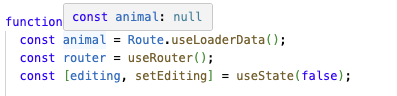
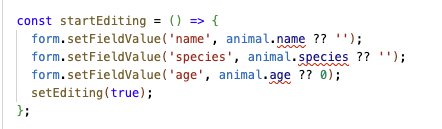

# REVIEW.md

## 13/05 - Evert

- your program.cs file is messy, split configuration into helper methods and move configuration responsibility to each module seperately
- your db conection strings are hardcoded, move them to appsettings.json
  
```csharp
// bad
...
builder.Services.AddDbContext<AnimalDbContext>(options =>
{
    options.UseSqlite(builder.Configuration.GetConnectionString("DefaultConnection")
           ?? "Data Source=animals.db");
});
builder.Services.AddScoped<AnimalService>();

builder.Services.AddDbContext<AppDbContext>(options =>
{
    options.UseSqlite(builder.Configuration.GetConnectionString("AppDb")
           ?? "Data Source=tsz.db");
});
builder.Services.AddScoped<CustomerService>();

```

```csharp
// impr

builder.Services.AddAnimalModule(builder.Configuration);
builder.Services.AddCustomerModule(builder.Configuration);

// move this to your customermodule
public sealed record CustomerConfg {
    public const string Key = "CustomerModule";

    public required string ConnectionString { get; init; }
}

public static class CustomerModuleConfiguration
{
    public static IServiceCollection AddCustomerModule(this IServiceCollection services, IConfiguration configuration)
    {
        var customerConfig = configuration.GetSection(CustomerConfg.Key).Get<CustomerConfg>();


        services.AddDbContext<AppDbContext>(options =>
        {
            options.UseSqlite(customerConfig.ConnectionString);
        });
        services.AddScoped<CustomerService>();
        return services;
    }
}
```

- Testing:

You have insufficient test coverge and there is litle coherence to be found in your tests. Split your tests into seperate files for each operation and test all variations.

Your tests focus on implementation details and do not communicate business value.

- Separation of concerns:

Your services do to much. 
  - they contain your Database logic, 
  - your bussiness logic 
  - your transaction management
  - your error handling

You are introducing a lot of coupling throughout your application,

Making it impossible to seperate modules later on.
For example Common.Counters is tightly coupled to your appcontext basicly coupling all of your modules together.

- API 

Your API will not scale, 

The way you catch each exception and return a custom error message is not maintainable, you should use a global exception handler and return a standard error response with an error code that can be used by the client to display a user friendly message.

Your api is exposing full database entities, you should use DTOs to decouple your API from your database schema and to have more control over the data that is exposed to the client.

## 08/05 - Peter

- Put your 'shadcn' remarks in /packages/web/CLAUDE.md, so a root CLAUDE.md for general stuff and a sub CLAUDE.md for specifics.
- Move duplicated tsx code to a component

```js
// bad
<div>
    <Input
        value={field.state.value}
        onChange={(e) => field.handleChange(e.target.value)}
        onBlur={field.handleBlur}
        autoFocus
    />
    {field.state.meta.errors.length > 0 && (
        <p className="mt-1 text-xs text-destructive">{field.state.meta.errors.join(', ')}</p>
    )}
</div>
```

```js
// impr
<div className="grid gap-2">
    <Label htmlFor={field.name}>Name</Label>
    <Input
    id={field.name}
    name={field.name}
    value={field.state.value}
    onBlur={field.handleBlur}
    onChange={(e) => field.handleChange(e.target.value)}
    />
    <FieldError field={field} />
</div>
```

en 

```js
function FieldError({ field }: { field: { state: { meta: { isTouched: boolean; errors: Array<unknown> } } } }) {
  if (!field.state.meta.isTouched || field.state.meta.errors.length === 0) return null;
  const message = field.state.meta.errors
    .map((err) => (typeof err === 'string' ? err : (err as { message?: string })?.message))
    .filter(Boolean)
    .join(', ');
  if (!message) return null;
  return <p className="text-sm text-destructive">{message}</p>;
}
```

- Add Zod validation to your server functions
- Add Zod validatiohn to you form
- Fix you typing issues




- Enable more strict openapi specs, better for the TS types generation.

```c#
builder.Services.ConfigureHttpJsonOptions(options =>
{
    options.SerializerOptions.NumberHandling = JsonNumberHandling.Strict;
});
builder.Services.AddOpenApi(options =>
{
    options.AddSchemaTransformer((schema, _, _) =>
    {
        if (schema.Properties is { Count: > 0 })
        {
            schema.Required ??= new HashSet<string>();
            foreach (var (name, property) in schema.Properties)
            {
                var isNullable = property.Type is { } t && (t & JsonSchemaType.Null) != 0;
                if (!isNullable)
                {
                    schema.Required.Add(name);
                }
            }
        }
        return Task.CompletedTask;
    });
});
```